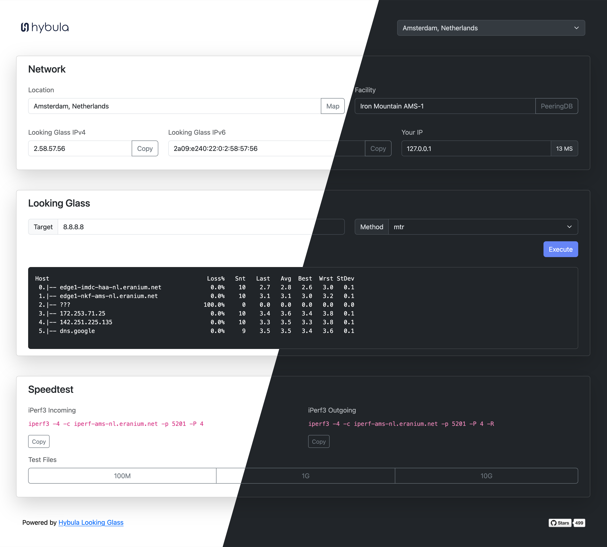

# Looking Glass
Modern, simple and fresh looking glass based on Bootstrap 5 and PHP 8 (also compatible with 7). A looking glass is a network utility which is
made user-friendly for everyone to use. It allows you to execute network related commands within a remote network, usually that of an ISP.

[](https://lg-nl-ams.hybula.net/)

### Demo
[See it in action here!](https://lg-nl-ams.hybula.net/)

### Features
- Bootstrap 5 UI.
- Real time command output using JavaScript.
- Supports ping/ping6, traceroute/traceroute6 and mtr/mtr6.
- Easy to customize and to configure.
- DNS checking to prevent unnecessary executions.
- Latency feature from visitor to LG.
- Dark/light/auto mode theme.

### Requirements
- Any Linux distribution, this has been tested on RHEL 8 + 9.
- PHP 7.1 or higher, PHP 8 preferred.
- IPv6 connectivity if you want to use the v6 equivalents.
- Root access.

### Installation
#### Manual
For this installation we will assume that we are working on AlmaLinux 8 or 9. Warning: This guide does not cover any security hardening or rate limiting.
Note: These steps also work with AlmaLinux 9, but it will install PHP 8 instead of 7.

1. Install the required network tools: `dnf install mtr traceroute -y`.
2. Install the web server with PHP (by default it will install 7.2 on RHEL 8): `dnf install httpd mod_ssl php php-posix -y`.
3. Enable and start Apache/PHP-FPM: `systemctl enable --now httpd && systemctl enable --now php-fpm`.
4. Let's help MTR to work, execute the following command: `ln -s /usr/sbin/mtr /usr/bin/mtr` and also mtr helper called mtr-packet: `ln -s /usr/sbin/mtr-packet /usr/bin/mtr-packet`.
5. You *must* configure SELinux before this all works, or you can disable SELinux using `setenforce 0` and possibly make it permanent: `nano /etc/selinux/config` change to `SELINUX=disabled`.
6. Upload the contents of the ZIP to /var/www/html/.
7. Rename config.dist.php to config.php and adjust the settings.
8. (Optional) You might want to enable SSL using LetsEncrypt, take a look at [acme.sh](https://github.com/acmesh-official/acme.sh).

#### Docker
For installation using Docker, follow these steps and run the commands on the target machine where the application should be installed:

1. First, ensure Docker and Docker Compose are already installed.
2. Clone this GitHub repository: `git clone https://github.com/hybula/lookingglass.git`.
3. Change your current working directory to the freshly cloned repository.
4. Currently, the Docker images are not hosted on an image repository, so you'll have to build them yourself with the following command: `docker compose build`.
5. For production use, change the environment variables inside the `docker-compose.yml` file to the desired values. For testing purposes, the default values are fine.
6. Create and start the containers: `docker compose up -d`.
7. Afterward, the Looking Glass should be reachable from your web browser at `http://$your_server_ip/`!

### iPerf3 Installation (Optional)
> It is recommended to install iPerf3 on a different server from your looking glass to avoid network congestion.

#### Manual
Again, we will assume that we are working on AlmaLinux 8 or 9.
1. Install iPerf3: `dnf install iperf3 -y`
2. Launch iPerf3 as a daemon: `iperf3 -sD -p 5201`.
3. (Optional) You might want to add a systemd unit file for iPerf3, so it automatically starts when the system boots up.
4. Locate the two lines containing `LG_SPEEDTEST_CMD_INCOMING` and `LG_SPEEDTEST_CMD_OUTGOING` respectively in `config.php`.
5. Change `hostname` in these lines to the IPv4 address of your iPerf3 server.

#### Docker
1. Uncomment the section for `iperf3` in `docker-compose.yml` if you want iPerf3 and the looking glass to be on the same server.
Otherwise, please copy the `iperf3` section and save it as `docker-compose.yml` on another server with Docker and Docker Compose installed.
2. Start the iPerf3 container: `docker compose up -d`.
3. Locate the two lines containing `LG_SPEEDTEST_CMD_INCOMING` and `LG_SPEEDTEST_CMD_OUTGOING` respectively in `docker/php-fpm/src/config.php`.
5. Change `hostname` in these lines to the IPv4 address of your iPerf3 server.

### Upgrading
Upgrading from a previous version is easy, simply overwrite your current installation with the new files. Then update your config.php accordingly, the script will automatically check for missing variables.

### Customization
If you open up config.dist.php you will see that there are some features that allows you to customize the looking glass, this includes a custom CSS override.
You may also extend the looking glass with a custom block.

### TODO
- Move to Composer;
- Software-based rate limiting;
- Implement a template engine, for advanced customization;
- Switch to WebSockets.

### Contribute
We would love to receive code contributions in the form of a pull request. We prefer this over forking, so if you have any code improvements feel free to commit.

### Credits
This project is inspired by the [LookingGlass project](https://github.com/telephone/LookingGlass) of @telephone and uses his procExecute() function, although slightly modified.

### Sponsored
This project is developed and sponsored by [Hybula B.V.](https://www.hybula.com/)
<p>
  <a href="https://www.hybula.com/">
    
  </a>
</p>

### License
```Apache License, Version 2.0 and the Commons Clause Restriction```
